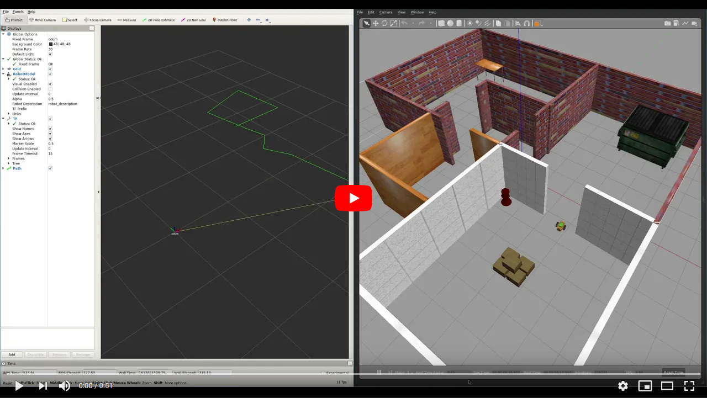

[//]: # (Image References)

[image1]: ./assets/gazebo_1.png "Gazebo"
[image2]: ./assets/gazebo_2.png "Gazebo"
[image3]: ./assets/gazebo_3.png "Gazebo"
[image4]: ./assets/gazebo_4.png "Gazebo"
[image5]: ./assets/gazebo_5.png "Gazebo"
[image6]: ./assets/gazebo_6.png "Gazebo"
[image7]: ./assets/gazebo_7.png "Gazebo"
[image8]: ./assets/gazebo_8.png "Gazebo"
[image9]: ./assets/gazebo_9.png "Gazebo" 
[image10]: ./assets/gazebo_10.png "Gazebo" 
[image11]: ./assets/gazebo_11.png "Gazebo" 
[image12]: ./assets/gazebo_12.png "Gazebo"
[image13]: ./assets/mogi_bot_1.png "MOGI bot" 
[image14]: ./assets/mogi_bot_2.png "MOGI bot" 
[image15]: ./assets/mogi_bot_3.png "MOGI bot" 
[image16]: ./assets/mogi_bot_4.png "MOGI bot" 
[image17]: ./assets/mogi_bot_5.png "MOGI bot" 
[image18]: ./assets/mogi_bot_6.png "MOGI bot"
[image19]: ./assets/simple_model.png "Simple model"
[image20]: ./assets/odom_1.png "Odometry" 
[image21]: ./assets/odom_2.png "Odometry" 
[image22]: ./assets/odom_3.png "Odometry" 
[image23]: ./assets/gazebo_13.png "Gazebo" 
[image24]: ./assets/gazebo_14.png "Gazebo"
[image25]: ./assets/simple_model_2.png "Simple model"
[image26]: ./assets/mogi_bot_7.png "MOGI bot"
[image27]: ./assets/diff_drive_1.png "Diff drive"
[image28]: ./assets/diff_drive_2.png "Diff drive"
[image29]: ./assets/mogi_bot_8.png "MOGI bot" 
[image30]: ./assets/mogi_bot_9.png "MOGI bot" 
[image31]: ./assets/mogi_bot_10.png "MOGI bot" 
[image32]: ./assets/mogi_bot_11.png "MOGI bot" 
[image33]: ./assets/mogi_bot_12.png "MOGI bot" 
[image34]: ./assets/mogi_bot_13.png "MOGI bot" 
[image35]: ./assets/mogi_bot_14.png "MOGI bot" 
[image36]: ./assets/skid_steer_1.png "Skid steer" 
[image37]: ./assets/skid_steer_2.png "Skid steer" 

# 3. - 4. hét - Gazebo és URDF

## Hova fogunk eljutni?

<a href="https://youtu.be/YRHxixKr6r4"></a>

# Gazebo

A Gazebo egy önálló fizikai szimulációs környezet, nem a ROS része, azonban rengeteg csomag segíti az integrációját a ROS-hoz. Jelenleg a 11-es verziónál tart. Melyik verziót használjuk? Mivel az ajánlott konfiguráció Ubuntu 18.04 + ROS Melodic, így a Gazebo 9.0-val dolgozunk, de kisebb módosításokkal minden működhet Ubuntu 20.04 + ROS Noetic és Gazebo 11-gyel is.

| Ubuntu | ROS     | Gazebo |
|--------|---------|--------|
| 18.04  | Melodic | 9.0    |
| 20.04  | Noetic  | 11.1   |

Ha a `ros-melodic-desktop-full` csomagot telepítettétek, akkor a Gazebo már telepítve van.

Ha valamiért még sincs telepítve akkor a `sudo apt install gazebo9` vagy `gazebo11` paranccsal tudjátok telepíteni.  
A Gazebo-t a `gazebo` paranccsal tudjuk elindítani. És a következő képernyővel indul:  
![alt text][image1]

Virtuális gép esetén, ha a következő hibát dobja a Gazebo és nem indul el:
```console
ros-user@ros-virtual-machine:~$ gazebo
VMware: vmw_ioctl_command error Invalid argument.
```

Akkor be kell állítani az `export SVGA_VGPU10=0` környezeti változót. Érdemes betenni a `./bashrc` fájlba ebben az esetben.

Gazebo 9 esetén még egy teendőnk van, a `~/.ignition/fuel/config.yaml` fájl szerkesztése, ha a Gazebo indulásakor a következő hibát látjátok:
```console
ros-user@ros-virtual-machine:~$ gazebo
[Err] [REST.cc:205] Error in REST request

libcurl: (51) SSL: no alternative certificate subject name matches target host name 'api.ignitionfuel.org'
```
Ebben az esetben a fenti fájlban a `url: https://api.ignitionfuel.org` sort a `url: https://api.ignitionrobotics.org`-re kell cserélni.


A `gazebo` parancs a `gzserver` és a `gzclient`-et foglalja össze. A `gzserver` a gazebo backendje, ez végzi a fizikai szimulációt, viszont nincs grafikus felülete. A `gzclient` adja a Gazebo grafikus felületét.

További hivatalos Gazebo tutorialok: [link](http://gazebosim.org/tutorials).

## Gazebo UI
A Gazebo-t megnyitva a következő képernyőt látjuk:  

![alt text][image2]

Részletes angol tutorial a UI-ról: [link](http://gazebosim.org/tutorials?cat=guided_b&tut=guided_b2)

A bal oldali panel (zöld) mutatja a szimulációban lévő objektumok hierarchiáját.  
Fent (piros) az eszköztár, mozgatás, forgatás, kamera beállítások, stb.  
Alul (barna) a szimuláció megállítása, elindítása, real-time faktor és időbélyegek.  
Középen (kék) a szimuláció 3D-s világa.

## Egyszerű modellek, modell library

Egyszerű gyakorlatok:
- helyezzünk egy kockát a szimulációba
- állítsuk meg a fizikai szimulációt, emeljük fel és forgassuk el a kockát
- engedélyezzük újra a szimulációt, hagyjuk leesni a kockát
- adjunk adott nagyságú erőt a kockára

![alt text][image3]
![alt text][image4]

A modell library-t az insert fül alatt találjuk:
![alt text][image23]

Egy kis ideig eltart, mire a Gazebo beolvassa a modelleket a szerverről, utána megjelenik a lista:
![alt text][image24]

## Model editor

Először is hozzunk létre egy ROS csomagot a leckének:  
`catkin_create_pkg bme_gazebo_basics roscpp rospy std_msgs actionlib actionlib_msgs`

Vagy töltsük le GitHub-ról a `git clone` paranccsal.

A model editort az edit menüben találjátok.

![alt text][image6]

Adjunk hozzá egy hengert majd egy kockát. A hengert méretezzük át és forgassuk el az ábra alapján:

![alt text][image5]

Állítsunk be egy jointot, majd mentsük el a `~/catkin_ws/src/bme_gazebo_basics/urdf` alá `simple_model` néven. Valójában egy mappát fogunk elmenteni, amiben lesz egy `model.sdf` és egy `model.config` fájl. Nemsokára megnézzük mit tudunk csinálni ezzel a modellel!

## Building editor

Nyissuk meg a building editort az edit menüből.

Adjuk hozzá a foorplant a `floorplan.png` fájlt az import gomb segítségével.  

Ha a GitHubról töltöttétek le a kezdőcsomagot, akkor ez a `worlds` mappában van, ha teljesen új csomagot csináltatok, akkor így tudjátok letölteni `wget`-tel:  
`wget https://raw.githubusercontent.com/MOGI-ROS/Week-3-Gazebo-basics/main/bme_gazebo_basics/worlds/floorplan.png`


![alt text][image7]
Állítsuk be valamelyik fal hosszát referenciaként a next gomb megnyomása után.

![alt text][image8]

Húzzuk be a falakat a floorplan alapján. Érdemes figyelni arra, hogy "záródjanak" a fal kontúrjai.

![alt text][image9]

Ajtókat és ablakokat hozzá tudunk adni a window és door toolokkal, viszont az ajtókat nem praktikus, mert ha térképet generálunk majd az épületről, akkor az ajtókat és ablakokat falként fogja kezelni.

![alt text][image10]

Elmenthetjük az épületet sdf fájlként, és visszatérhetünk a Gazebohoz. Fontos, hogy mentés után többet az épület nem szerkeszthető!

![alt text][image11]

Opcionális: tehetünk bele pár objektumot a Gazebo model libraryből:

![alt text][image12]

Mentsük el a Gazebo világot world_modified.world néven, ezt fogjuk betölteni Gazebo-ba a szimuláció során.

Ki is tudjuk próbálni az elmentett világ betöltését Gazeboba:  
`gazebo world_modified.world`


## Launchfile

Készítsünk egy launchfile-t `world.launch` néven, ami megnyitja a Gazebot és betölti az elmentett világunkat.

Emlékeztetőül:  
`roscd bme_gazebo_basics`  
`cd launch`  
`touch world.launch`

```xml
<?xml version="1.0" encoding="UTF-8"?>

<launch>

  <!-- World File -->
  <arg name="world_file" default="$(find bme_gazebo_basics)/worlds/world_modified.world"/>

  <!-- Launch Gazebo World -->
  <include file="$(find gazebo_ros)/launch/empty_world.launch">
    <arg name="use_sim_time" value="true"/>
    <arg name="debug" value="false"/>
    <arg name="gui" value="true" />
    <arg name="world_name" value="$(arg world_file)"/>
  </include>

</launch>
```

A már megszokott módon fordítsuk újra a catkin workspace-t a workspace gyökerében, és töltsük be a környezetet:  
`catkin_make`  
`source devel/setup.bash`  

Ezek után el is tudjuk indítani a frissen létrehozott launchfile-unkat, ami megnyitja a Gazebo-t és betölti a világot:  
`roslaunch bme_gazebo_basics world.launch`

---

# URDF fájl

## URDF konvertálás

Az előbb elmentett simple_model sdf formátumban van, ami a Gazebonak ugyan megfelel, azonban a ROS-nak nem. A ROS-nak URDF fájlra van szüksége.
Megpróbálhatjuk átkonvertálni az sdf fájlokat, de csak a baj lesz vele, tényleg. Érdemes a robotokat urdf/xacro fájlként modellezni, ezeket a ROS és a Gazebo is tudja kezelni. A háttérben a Gazebo egyébként sdf-fé konvertálja az URDF-jeinket, de ezzel nem kell foglalkoznunk.

Itt egy konvertáló tool, ha mégis meg szeretnénk próbálni:

https://github.com/MOGI-ROS/pysdf

A `git clone` paranccsal tudjátok letölteni a `catkin_ws/src` mappába:  
`git clone https://github.com/MOGI-ROS/pysdf`  
`catkin make`  
`source devel/setup.bash`

A `pysdf`-et ROS csomagként indíthatjuk, és a `-h` segít a paraméterekkel.

```console
david@DavidsLenovoX1:~/catkin_ws$ rosrun pysdf sdf2urdf.py -h
usage: sdf2urdf.py [-h] [-p PLOT] [--no-prefix] sdf urdf

positional arguments:
  sdf                   SDF file to convert
  urdf                  Resulting URDF file to be written

optional arguments:
  -h, --help            show this help message and exit
  -p PLOT, --plot PLOT  Plot SDF to file
  --no-prefix           Do not use model name as name prefix
```

`rosrun pysdf sdf2urdf.py ~/catkin_ws/src/Week-3-4-Gazebo-basics/bme_gazebo_basics/urdf/simple_model/model.sdf ~/catkin_ws/src/Week-3-4-Gazebo-basics/bme_gazebo_basics/urdf/simple_model.urdf`

A konverzió után van még egy kis javítani valónk a két testet összekötő jointtal, ugyanis a következő lépésben hibára futnánk.
A Gazebo nem végtelenül forgó `continuous` jointtal geneárlta a fájlt, hanem limitált `revolute` jointtal és 10<sup>308</sup>-on radián limittel. Ez a következő nem túl egyértelmű hibát fogja eredményezni:

```console
Traceback (most recent call last):
  File "/opt/ros/melodic/lib/joint_state_publisher_gui/joint_state_publisher_gui", line 53, in <module>
    num_rows)
  File "/opt/ros/melodic/lib/python2.7/dist-packages/joint_state_publisher_gui/__init__.py", line 124, in __init__
    self.center()
  File "/opt/ros/melodic/lib/python2.7/dist-packages/joint_state_publisher_gui/__init__.py", line 181, in center
    joint_info['slider'].setValue(self.valueToSlider(joint['zero'], joint))
TypeError: setValue(self, int): argument 1 has unexpected type 'float'
```

A helyes megoldás erre az, hogy:
1) A `revolute` típusú jointunkat `continuous`-re változtatjuk.
2) Csökkentjük a joint limitjét pl +/- 10 radiánra.

```xml
  <joint name="simple_model__link_1_JOINT_0" type="revolute">
    <parent link="simple_model__link_1"/>
    <child link="simple_model__link_0"/>
    <origin rpy="-1.5708  0      0" xyz="-0.00269 -0.28628  0"/>
    <axis xyz="0  0  1"/>
    <limit effort="-1.0" lower="-1.79769e+308" upper="1.79769e+308" velocity="-1.0"/>
  </joint>
```

Ezek után meg tudjuk nyitni az átkonvertált modellünket!

---

## URDF megnyitása az RViz-ben

Az alap ROS telepítésben van egy `urdf_tutorial`, ezt felhasználhatjuk a modellünk megjelenítésére:

`roslaunch urdf_tutorial display.launch model:='$(find bme_gazebo_basics)/urdf/simple_model.urdf'`

Sajnos nem tudjuk módosítani az RViz beállításait, mivel egy read-only csomagot használtunk a megjelenítéshez, ezért készítsünk egy saját launch fájlt az URDF-ünk megnyitására `check_urdf.launch` néven:

```xml
<?xml version="1.0" encoding="UTF-8"?>

<launch>

  <arg name="model" default="$(find bme_gazebo_basics)/urdf/simple_model.urdf"/>
  <arg name="gui" default="true" />
  <arg name="rvizconfig" default="$(find bme_gazebo_basics)/rviz/simple_model.rviz" />

  <param name="robot_description" command="$(find xacro)/xacro.py $(arg model)" />
  <param name="use_gui" value="$(arg gui)"/>

  <node name="joint_state_publisher_gui" pkg="joint_state_publisher_gui" type="joint_state_publisher_gui" />
  <node name="robot_state_publisher" pkg="robot_state_publisher" type="robot_state_publisher" />
  <node name="rviz" pkg="rviz" type="rviz" args="-d $(arg rvizconfig)" required="true" />

</launch>
```

Ebben a launch fájlban több csomagot, argumentumokat és paramétereket is használunk!  

- [Joint state publisher](http://wiki.ros.org/joint_state_publisher), a joint state publisher az URDF modellünk minden, nem fix jointjának adatait publsholja egy Joint State típusú üzenetben.
- [Robot state publisher](http://wiki.ros.org/robot_state_publisher), a robot state publisher az URDF modell és a joint state publisher által küldött adatok alapján meghatározza a robotunk összes transzformációját. Ezek a transzformációk a tf-ben állnak rendelkezésre, erről majd egy picit később részletesen beszélünk.
- [RViz](http://wiki.ros.org/rviz), az RViz pedig egy univerzális megjelenítő, amit a félév során rengeteg dologra fogunk használni.

Van továbbá 3 olyan argumentuma, ami a launch fájl indításakor command line-ból paraméterezhető a következő formában:  
`roslaunch NODE LAUNCHFILE ARG:=VALUE`

Mivel ezeknek a argumentumoknak van default értéke, így ebben az esetben nem kell kitöltenünk, kizárólag a default értékek felülbírására való.

Van továbbá 2 paraméter is a launchfile-ban. Ezek bekerülnek a ROS paraméter szerverébe minden node számára elérhető formában, így szedi össze a robot modelljét az RViz is. A ROS paraméter szerevere a [ROS master része](http://wiki.ros.org/Parameter%20Server). Innen ismeri a joint state publisher és a robot state publisher is az URDF modellünket.

Az éppen futó ROS paramétereinek bármikor meg tudjuk nézni a `rosparam list` paranccsal, valamint egy adott paraméter értékét a `rosparam get /PARAMETER` paranccsal.

Ha például létrehozunk egy újabb paramétert:
```xml
<param name="hello" value="HELLO WORLD!"/>
```

Akkor a következőt látjuk a fenti parancsok után:

```console
david@DavidsLenovoX1:~$ rosparam list
/hello
/robot_description
/rosdistro
/roslaunch/uris/host_172_30_22_32__37359
/rosversion
/run_id
/use_gui
david@DavidsLenovoX1:~$ rosparam get /hello
HELLO WORLD!
```

Indítsuk is el akkor a launchfile-t:  
`roslaunch bme_gazebo_basics check_urdf.launch`

Az RViz mutatja a modellünket, valamint a transzformációkat.  
![alt text][image19]

A joint state publisher GUI-ja segítségével pedig állíthatjuk a meglévő jointunk szögét.  
![alt text][image25]

## URDF / Xacro készítése

Mivel Gazebo-ból nem érdemes modellt exportálnunk a fentiek miatt, akkor hogyan csináljuk meg a robotunk modelljét URDF-ben?

A legegyszerűbb megoldás az, hogy kézzel. Az URDF fájl egy speciális `xml` fájl, amiben linkeket és jointokat definiálunk. A leggyakrabban használt joint típusok a `fixed` as a korábban is látott `continuous` és `revolute`. A `fixed` jointok statikus transzformációk, ilyen lehet például egy szenzor vagy egy kamera elhelyezkedése a robot alvázához képest. A `continuous` egy limit nélküli forgó joint, ilyenek például a kerekek. A `revolute` jointok pedig olyan forgó jointok, amiknek alsó és felső szöglimitjei vannak, ilyenek tipikusan a robotkarok jointjai.

Mielőtt még elkészítenénk az URDF fájlunkat, érdemes megjegyezni, hogy valójában xacro fájlt fogunk készíteni, ami az URDF kiterjesztése, de ennek a részleteibe most nem megyünk bele.

### A robot alváza

A leendő robotunk egy differenciálhajtású robot lesz 1-1 kerékkel a két oldalon. Azonban mielőtt a kerekeket hozzáadnánk, csináljuk meg a robot alvázát, ami a `base_footprint`-ből kiinduló `base_link` lesz, rajta két gömbkerékkel elöl és hátul.

Hozzuk létre a `mogi_bot.xacro` fájlt az urdf mappán belül.

```xml
<?xml version='1.0'?>

<robot name="mogi_bot" xmlns:xacro="http://www.ros.org/wiki/xacro">

  <link name="base_footprint"></link>

  <joint name="base_footprint_joint" type="fixed">
    <origin xyz="0 0 0" rpy="0 0 0" />
    <parent link="base_footprint"/>
    <child link="base_link" />
  </joint>

  <link name='base_link'>
    <pose>0 0 0.1 0 0 0</pose>

    <inertial>
      <mass value="15.0"/>
      <origin xyz="0 0 0" rpy="0 0 0"/>
      <inertia
          ixx="0.1" ixy="0" ixz="0"
          iyy="0.1" iyz="0"
          izz="0.1"
      />
    </inertial>

    <collision name='collision'>
      <origin xyz="0 0 0" rpy="0 0 0"/> 
      <geometry>
        <box size=".4 .2 .1"/>
      </geometry>
    </collision>

    <visual name='base_link_visual'>
      <origin xyz="0 0 0" rpy="0 0 0"/>
      <geometry>
        <box size=".4 .2 .1"/>
      </geometry>
    </visual>

    <collision name='rear_caster_collision'>
      <origin xyz="-0.15 0 -0.05" rpy="0 0 0"/>
      <geometry>
        <sphere radius="0.0499"/>
      </geometry>
    </collision>

    <visual name='rear_caster_visual'>
      <origin xyz="-0.15 0 -0.05" rpy="0 0 0"/>
      <geometry>
        <sphere radius="0.05"/>
      </geometry>
    </visual>

    <collision name='front_caster_collision'>
      <origin xyz="0.15 0 -0.05" rpy="0 0 0"/>
      <geometry>
        <sphere radius="0.0499"/>
      </geometry>
    </collision>

    <visual name='front_caster_visual'>
      <origin xyz="0.15 0 -0.05" rpy="0 0 0"/>
      <geometry>
        <sphere radius="0.05"/>
      </geometry>
    </visual>

  </link>

</robot>
```

Minden link tartalmaz legalább 1 `inertial`, `collision` és `visual` attribútumokat. A `visual` és `collision` a későbbiek során látjuk majd, hogy eltérhet, mert sok esetben elegendő egy egyszerűbb `collision` modell és egy látványosabb `visual` modell.

Az korábban használt launch fájlunkat felhasználva jelenítsük meg a robotot RViz-ben:  
`roslaunch bme_gazebo_basics check_urdf.launch model:='$(find bme_gazebo_basics)/urdf/mogi_bot.xacro' rvizconfig:='$(find bme_gazebo_basics)/rviz/mogi_bot.rviz'`

![alt text][image13]

### A robot kerekei

Adjunk hozzá 2 kereket is a fájl végére a `</robot>` tag elé. A kerekek `continuous` jointtal csatlakoznak a robot alvázához (`base_link`) annak közepén.

```xml
  <joint type="continuous" name="left_wheel_joint">
    <origin xyz="0 0.15 0" rpy="0 0 0"/>
    <child link="left_wheel"/>
    <parent link="base_link"/>
    <axis xyz="0 1 0" rpy="0 0 0"/>
    <limit effort="10000" velocity="1000"/>
    <dynamics damping="1.0" friction="1.0"/>
  </joint>

  <link name='left_wheel'>
    <inertial>
      <mass value="5.0"/>
      <origin xyz="0 0 0" rpy="0 1.5707 1.5707"/>
      <inertia
          ixx="0.1" ixy="0" ixz="0"
          iyy="0.1" iyz="0"
          izz="0.1"
      />
    </inertial>

    <collision name='collision'>
      <origin xyz="0 0 0" rpy="0 1.5707 1.5707"/> 
      <geometry>
        <cylinder radius=".1" length=".05"/>
      </geometry>
    </collision>

    <visual name='left_wheel_visual'>
      <origin xyz="0 0 0" rpy="0 1.5707 1.5707"/>
      <geometry>
        <cylinder radius=".1" length=".05"/>
      </geometry>
    </visual>
  </link>

  <joint type="continuous" name="right_wheel_joint">
    <origin xyz="0 -0.15 0" rpy="0 0 0"/>
    <child link="right_wheel"/>
    <parent link="base_link"/>
    <axis xyz="0 1 0" rpy="0 0 0"/>
    <limit effort="10000" velocity="1000"/>
    <dynamics damping="1.0" friction="1.0"/>
  </joint>

  <link name='right_wheel'>
    <inertial>
      <mass value="5.0"/>
      <origin xyz="0 0 0" rpy="0 1.5707 1.5707"/>
      <inertia
          ixx="0.1" ixy="0" ixz="0"
          iyy="0.1" iyz="0"
          izz="0.1"
      />
    </inertial>

    <collision name='collision'>
      <origin xyz="0 0 0" rpy="0 1.5707 1.5707"/> 
      <geometry>
        <cylinder radius=".1" length=".05"/>
      </geometry>
    </collision>

    <visual name='right_wheel_visual'>
      <origin xyz="0 0 0" rpy="0 1.5707 1.5707"/>
      <geometry>
        <cylinder radius=".1" length=".05"/>
      </geometry>
    </visual>
  </link>
```

Nyissuk meg ugyanúgy RVizben:  
`roslaunch bme_gazebo_basics check_urdf.launch model:='$(find bme_gazebo_basics)/urdf/mogi_bot.xacro' rvizconfig:='$(find bme_gazebo_basics)/rviz/mogi_bot.rviz'`

![alt text][image14]


# URDF betöltése (spawn) Gazebo-ba és RViz-be

Készítsünk egy launchfile-t (`spawn_robot.launch`), ami betölti a robot modellt RVizbe, ahogy az előbb, de beteszi a robotot a fizikai szimulációba is.

A `spawn_robot.launch` tartalma:

```xml
<?xml version="1.0"?>

<launch>

  <!-- RViz config file -->
  <arg name="rvizconfig" default="$(find bme_gazebo_basics)/rviz/mogi_world.rviz" />
  <arg name="model" default="$(find bme_gazebo_basics)/urdf/mogi_bot.xacro"/>

  <!-- Robot pose -->
  <!-- Inititalize it's position in the desired location inside the world -->
  <arg name="x" default="2.5"/>
  <arg name="y" default="1.5"/>
  <arg name="z" default="0"/>
  <arg name="roll" default="0"/>
  <arg name="pitch" default="0"/>
  <arg name="yaw" default="0"/>

  <!-- Launch our Gazebo world -->
  <include file="$(find bme_gazebo_basics)/launch/world.launch"/>

  <!-- Find mogi_bot description and send urdf to param server -->
  <param name="robot_description" command="$(find xacro)/xacro.py $(arg model)" />

  <!-- Send joint values-->
  <node name="joint_state_publisher" pkg="joint_state_publisher" type="joint_state_publisher">
    <param name="use_gui" value="false"/>
  </node>

  <!-- Send robot states to tf -->
  <node name="robot_state_publisher" pkg="robot_state_publisher" type="robot_state_publisher" respawn="false" output="screen"/>

  <!-- Spawn mogi_bot -->
  <node name="urdf_spawner" pkg="gazebo_ros" type="spawn_model" respawn="false" output="screen" 
    args="-urdf -param robot_description -model mogi_bot 
            -x $(arg x) -y $(arg y) -z $(arg z)
            -R $(arg roll) -P $(arg pitch) -Y $(arg yaw)"/>

  <!-- Launch RViz -->
  <node name="rviz" pkg="rviz" type="rviz" args="-d $(arg rvizconfig)" required="true" />

</launch>
```

A korábbi launchfájlhoz képest egy új node-ot használunk, ez az `spawn_model`, ahogy a neve is mutatja, ez helyezi el az URDF modellünket a Gazebo szimulációban.

A robot kezdőpozíciója (és orientációja) tetszőlegesen szerkeszthető a launchfile-ban, vagy a launchfile indításakor paraméterként, például:  
`roslaunch bme_gazebo_basics spawn_robot.launch yaw:=1.57`

![alt text][image26]

# Gazebo plugin

Most már be tudjuk tölteni a modellünket a fizikai szimulációba, de nem tudjuk megmozdítani még. Ehhez szükségünk van egy Gazebo pluginre. A szimulációban egy differenciálhajtású robotunk lesz két kerékkel, ehhez [ezt](http://gazebosim.org/tutorials?tut=ros_gzplugins#DifferentialDrive) a Gazebo plugint fogjuk használni.

## Differenciálhajtás

A [differenciálhajtású](https://en.wikipedia.org/wiki/Differential_wheeled_robot) robot egy egyszerű két kerekű robot, tipikusan ilyenek a robotporszívók vagy akár a hoverboardok. A robot fordulókörének a sugara (`R`), a fordulási sebessége (`ω`) és a kerekeinek sebeségei (`v`<sub>`l`</sub> és `v`<sub>`r`</sub>) között a lenti egyenletek írhatók fel, ahol a két kerék távolságával (`l`). 

![alt text][image27]

![alt text][image28]

[[forrás](http://www.cs.columbia.edu/~allen/F17/NOTES/icckinematics.pdf)]

A fenti egyenletek alapján 3 speciális eset adódik:  
1) `v`<sub>`l`</sub> `= v`<sub>`r`</sub>, ekkor az `R` fordulókör sugara végtelen a `ω` fordulási sebesség pedig 0. A robot tehát egyenesen halad.
2) `v`<sub>`l`</sub> `= -v`<sub>`r`</sub>, ekkor `R = 0` tehát a forgás középpontja pontosan a két kerék között helyezkedik el. A robot tehát egyhelyben forog.
3) `v`<sub>`l`</sub> `= 0` vagy `v`<sub>`r`</sub> `= 0`, ebben az esetben `R = l/2` vagyis a forgás középpontja az álló kerék. A robot ilyenkor pontosan az álló kerék körül forog.

Hasonlóan egyszerű fordítva is, a kerekek távolságából és a kerekek sebességéből egyszerűen integrálható a robot által megtett útvonal. Nagy vonalakban ezeknek az egyenleteknek az implmentációját valósítja meg az általunk használt Gazebo plugin, tehát egy sor kódot sem kell írnunk!

Hozzunk létre egy `mogi_bot.gazebo` fájlt az urdf mappában, ebben írjuk le a plugint.

```xml
<?xml version="1.0"?>
<robot>

  <gazebo>
    <plugin name="differential_drive_controller" filename="libgazebo_ros_diff_drive.so">
      <legacyMode>false</legacyMode>                         <!-- Set to true to swap right and left wheels, defaults to true -->
      <updateRate>10</updateRate>                            <!-- Plugin update rate in Hz -->
      <leftJoint>left_wheel_joint</leftJoint>                <!-- Name of left joint, defaults to `left_joint` -->
      <rightJoint>right_wheel_joint</rightJoint>             <!-- Name of right joint, defaults to `right_joint` -->
      <wheelSeparation>0.4</wheelSeparation>                 <!-- The distance from the center of one wheel to the other, in meters, defaults to 0.34 m -->
      <wheelDiameter>0.2</wheelDiameter>                     <!-- Diameter of the wheels, in meters, defaults to 0.15 m -->
      <wheelTorque>10</wheelTorque>                          <!-- Maximum torque which the wheels can produce, in Nm, defaults to 5 Nm -->
      <wheelAcceleration>1.0</wheelAcceleration>             <!-- Wheel acceleration, in rad/s^2, defaults to 0.0 rad/s^2 -->
      <commandTopic>cmd_vel</commandTopic>                   <!-- Topic to receive geometry_msgs/Twist message commands, defaults to `cmd_vel` -->
      <odometryTopic>odom</odometryTopic>                    <!-- Topic to publish nav_msgs/Odometry messages, defaults to `odom` -->
      <odometryFrame>odom</odometryFrame>                    <!-- Odometry frame, defaults to `odom` -->
      <robotBaseFrame>base_footprint</robotBaseFrame>        <!-- Robot frame to calculate odometry from, defaults to `base_footprint` -->
      <odometrySource>world</odometrySource>                 <!-- Odometry source, 0 for ENCODER, 1 for WORLD, defaults to WORLD -->
      <publishWheelTF>false</publishWheelTF>                 <!-- Set to true to publish transforms for the wheel links, defaults to false -->
      <publishOdomTF>true</publishOdomTF>                    <!-- Set to true to publish transforms for the odometry, defaults to true -->
      <publishWheelJointState>false</publishWheelJointState> <!-- Set to true to publish sensor_msgs/JointState on /joint_states for the wheel joints, defaults to false -->
      <publishTf>1</publishTf>                               <!-- Set to 1 (true) to publish transforms from Gazebo, defaults to 1 -->
      <rosDebugLevel>na</rosDebugLevel>                      <!-- ROS Debug level, defaults to na -->
    </plugin>
  </gazebo>

</robot>
```

Majd adjuk hozzá ezt a fájlt a robotunk leírásához a `mogi_bot.xacro` fájlunkhoz:
```xml
<xacro:include filename="$(find bme_gazebo_basics)/urdf/mogi_bot.gazebo" />
```

Még a `<link name="base_footprint"></link>` előtt, tehát így kell kinéznie a `mogi_bot.xacro` fájlunknak:
```xml
<?xml version='1.0'?>

<robot name="mogi_bot" xmlns:xacro="http://www.ros.org/wiki/xacro">

  <xacro:include filename="$(find bme_gazebo_basics)/urdf/mogi_bot.gazebo" />

  <link name="base_footprint"></link>

  ...
```

# A robot mozgatása `cmd_vel` twist üzenettel

A plugin beállításakor beállítottuk, hogy a szimulált robotunkat a cmd_vel topicon érkező Twist üzenettel lehet vezetni. 

```xml
<commandTopic>cmd_vel</commandTopic>                   <!-- Topic to receive geometry_msgs/Twist message commands, defaults to `cmd_vel` -->
```

Innentől kezdve a robotunk egy Twist típusú üzenetet vár és onnantól az irányítása gyakorlatilag megegyezik a Turtlesim vezetésével!

Akkor tehát használhatjuk a `turtle_teleop_key`-t a robot irányítására? 

Próbáljuk ki!

Indítsuk el a robot szimulációját az előbbi paranccsal:  
`roslaunch bme_gazebo_basics spawn_robot.launch`

Majd indítsuk el a turtle_teleop_key-t:  
`rosrun turtlesim turtle_teleop_key`

## Hibakeresés

A robot nem mozdul meg, ennek az az oka, hogy ugyan Twist típusú üzenetet küld a távirányító és Twist típusú üzenetet vár a szimulált robot is, azonban nem ugyanazon a topicon próbálnak kommunikálni!
Az előzőekben használt eszközökkel is meg tudjuk ezt vizsgálni:  

Használjuk a `rosnode list`, valamint a  
`rosnode info /turtle_teleop_key` parancsokat:

```console
Node [/turtle_teleop_key]
Publications: 
 * /rosout [rosgraph_msgs/Log]
 * /turtle1/cmd_vel [geometry_msgs/Twist]
 
Subscriptions: 
 * /clock [rosgraph_msgs/Clock]
```

Ugyanígy nézzük meg a `rosnode info /gazebo` parancsot:

```console
Node [/gazebo]
Publications: 
 * /clock [rosgraph_msgs/Clock]
 * /gazebo/link_states [gazebo_msgs/LinkStates]
 * /gazebo/model_states [gazebo_msgs/ModelStates]
 * /gazebo/parameter_descriptions [dynamic_reconfigure/ConfigDescription]
 * /gazebo/parameter_updates [dynamic_reconfigure/Config]
 * /odom [nav_msgs/Odometry]
 * /rosout [rosgraph_msgs/Log]
 * /tf [tf2_msgs/TFMessage]

Subscriptions: 
 * /clock [rosgraph_msgs/Clock]
 * /cmd_vel [unknown type]
 * /gazebo/set_link_state [unknown type]
 * /gazebo/set_model_state [unknown type]
```

Megvizsgálhatjuk a problémát a rostopic segítségével is  

`rostopic list`

`rostopic info /turtle1/cmd_vel`

```console
Type: geometry_msgs/Twist

Publishers: 
 * /turtle_teleop_key (http://172.17.19.175:39745/)

Subscribers: None
```

valamint `rostopic info /cmd_vel`

```console
Type: geometry_msgs/Twist

Publishers: None

Subscribers: 
 * /gazebo (http://172.17.19.175:40875/)
```

Egy másik nagyon hasznos eszköz a hibakeresés során az `rqt_graph`!

Indítsuk el az `rqt_graph` paranccsal.

![alt text][image18]

Ahogy látjuk a `/turtle_teleop_key` node-ot nem köti össze topic a `/gazebo` node-dal.

## A megoldás - `remap`

Tehát használhatjuk ezt az irányításra, viszont alapértelmezetten a `turtle_teleop_key` más topicba (`/turtle1/cmd_vel`) küldi az üzeneteket. Módosíthatnánk a Gazebo plugint, hogy a megfelelő topicon várja a Twist üzenetet, azonban az a konvenció a ROS-ban, hogy a robotunkat a cmd_vel topicon érkező Twist üzenettel mozgatjuk.

Megoldás: csomagoljuk be egy launchfile-ba a turtle_teleop_key-t, és irányítsuk át a cmd_vel topicra!

```xml
<?xml version="1.0" encoding="UTF-8"?>

<launch>

  <node name="turtle_teleop_key" pkg="turtlesim" type="turtle_teleop_key" output="screen">
    <remap from="/turtle1/cmd_vel" to="cmd_vel"/>
  </node>

</launch>
```

Indítsuk el a launchfile-t ls nézzük meg az `rqt_graph` parancsot!

![alt text][image17]

A turtle_teleop_key nem igazán praktikus, mert nem tudunk megállni. De van erre egy [megfelelő ROS csomag](http://wiki.ros.org/key_teleop)!  
Azonban ez sem a cmd_vel topicra küldi a Twist üzeneteit alapból, hanem a key_vel-re. Megváltoztathatnánk a plugin beállításunkat, de inkább tegyük be ezt is a launchfile-ba, és mappeljük át a topicot!

```xml
<?xml version="1.0" encoding="UTF-8"?>

<launch>

  <node name="key_teleop" pkg="key_teleop" type="key_teleop.py" output="screen">
    <remap from="key_vel" to="cmd_vel"/>
  </node>

</launch>
```

Vagy egy másik lehetőség egy [összetettebb parancssoros távirányító node](http://wiki.ros.org/teleop_twist_keyboard)!  
A teleop_twist_keyboard alapból a cmd_vel topicra küldi a Twist üzenetét, így ezt nem is kell átirányítanunk!

```xml
<?xml version="1.0" encoding="UTF-8"?>

<launch>

  <node name="teleop_twist_keyboard" pkg="teleop_twist_keyboard" type="teleop_twist_keyboard.py" output="screen"/>

</launch>
```


# TF

A ROS folyamatosan nyilvántartja a robot egyes linkjeinek egymáshoz képesti transzformációit, ezt a TF (transzformáció) modul végzi a már korábban látott `robot_state_publisher` és `joint_state_publisher` segítségével. A linkek között több féle transzformáció lehetséges, ezek közül már sokkal találkoztunk:
- fixed, ebben az esetben a transzformáció egy statikus eltolás és/vagy forgatás.
- revolute és continuous forgó jointok
- prismatic csúszó jointok
- floating és planar jointok, amikkel egyelőre nem foglalkozunk

Egy speciális transzformáció az odometria is, ami a robot alvázának (a mi esetünkben a `base_footprint`) elmozdulását mondja meg egy fix koordinátarendszerhez (`odom`) képest. A koordinátarendszer nevét a `differential_drive_controller` adtuk meg. Ameddig a robot mozog ez a transzformáció is folyamatosan változik a `base_footprint` link koordinátarendszere és az `odom` rögzített koordintátarendszer között.

Egy valódi roboton az odometriát a kerekek jeladói és a robot pontos geometriájának ismeretében tudnánk kiszámítani, ahogy a differenciálhajtásnál már találkoztunk ezzel. Jelen esetben a motorok és a jeladók is a szimuláció részét képezik, tehát a robot odometriáját a Gazebo plugin adja nekünk.

A transzformációk egy olyan gráfot adnak, ahol a gráf csomópontjai a robot egyes linkjei. Ezt a gráfot bármikor megnézhetjük az `rqt_tf_tree` segítségével.

A következő paranccsal tudjuk elindítani:
```console
rosrun rqt_tf_tree rqt_tf_tree
```
Az eredmény pedig így néz ki:

![alt text][image21]


## Odometria a ROS-ban

Ha a robot odometria transzformációját fix időpillanatonként rögzítenénk, akkor megkapnánk a robot mozgásának teljes történetét. Szerencsére erre is van kész megoldás a ROS-ban, a [Hector trajectory server](https://wiki.ros.org/hector_trajectory_server).

Ez egy olyan csomag, ami nem része az alap ROS telepítésnek, de az Ubuntu csomagkezelőjével gond nélkül telepíthetjük:
```console
sudo apt install ros-melodic-hector-trajectory-server
```

Telepítés után, adjuk hozzá a `spawn_robot.launch` fájlunkhoz a trajektória mentését a `hector_trajectory_server` node hozzáadásával. A node használatához 2 dolgot kell beállítanunk, a két koordinátarendszert, amik között a transzformációt rögzíteni szeretnénk.

```xml
  <!-- Launch trajectory server -->
  <node pkg="hector_trajectory_server" type="hector_trajectory_server" respawn="false" name="hector_trajectory_server" output="screen">
    <param name="source_frame_name" value="base_footprint"/>
    <param name="target_frame_name" value="odom"/>
  </node>
```

Indítsuk el a szimulációt a `roslaunch bme_gazebo_basics spawn_robot.launch` segítségével, illetve egy másik parancssorban indítsuk el a távirányítást a `roslaunch bme_gazebo_basics teleop.launch` paranccsal.

![alt text][image20]

Nézzük meg most a node-jainkat az `rqt_graph` segítségével!

![alt text][image22]

# A robot megjelenése

Tehát van egy működő robotunk, amit szimulálunk a Gazeboban és megjelenítünk RVizben. Gazeboban azonban az egész fehér, RVizben pedig az egész piros. Hogyan tudnánk kiszínezni?

## Színek

Külön kell színeznünk Gazeboban és RVizben.

### RViz színek

RViz esetén az URDF-ünkben szereplő egyes linkek `visual` tagjében kell megadnunk a színt egy `material` attribútummal.
Példa:
```xml
    <visual name='left_wheel_visual'>
      <origin xyz="0 0 0" rpy="0 1.5707 1.5707"/>
      <geometry>
        <cylinder radius=".1" length=".05"/>
      </geometry>
      <material name="green"/>
    </visual>
```

Akkor tudunk ilyen egyszerűen színeket hivatkozni, ha az URDF fájlunk elején meghivatkozzuk a `materials.xacro` fájlt, amiben előre létrehoztam pár színt.

Színezzük a robot alvázát narancs színűre a kerekeit pedig zöldre.

```xml
<xacro:include filename="$(find bme_gazebo_basics)/urdf/materials.xacro" />
```
![alt text][image29]

A robot modell átlátszóságát az `alpha` érték változtatásával tudjátok állítani.

### Gazebo színek

Gazeboban viszont továbbra is fehér a modell. Ezt is az URDF-ben tudjuk megoldani, de a Gazebo más formában várja a material megadását. Adjuk hozzá az URDF fájlhoz a következőt:

```xml
  <gazebo reference="left_wheel">
    <material>Gazebo/Green</material>
  </gazebo>
```
Ugyanúgy színezzük ki a kerekeket zöldre az alvázat pedig narancssárgára.

![alt text][image30]


## 3D modell, Collada fájl

A robotunk modelljét azonban nem csak táglatestekből és hengerekből építhetjük meg amiket kiszínezhetünk, hanem 3D modelleket is használhatunk. Praktikus azonban a linkek `collision`-jét ilyen egyszerű testeknek megtartani, mert a szimulációnak sokkal kevesebbet kell számolnia, mint egy bonyolult mesh esetén. A `visual` tagben viszont gond nélkül kicserélhetjük.

Az URDF fájlokban Collada (.dae) vagy STL fájlokat lehet meshként használni. STL esetén sajnos nincs lehetőség a meshen belül különböző színeket használni, ezért a Collada meshek a javasoltak. De hogyan készítünk Collada fájlokat?

Sajnos a CAD szoftverek nem exportálnak Collada formátumba, ezért ezek előállítására a Blendert javaslom.

Ha CAD SW-ből exportáltok STL-t, amit aztán Blenderrel alakítotok át Collada mesh-sé, akkor javaslom, hogy minden méretezést és forgatást Blenderben csináljatok meg, ahogy a színezést is.

![alt text][image31]

A kísérletezés során praktikus az RViz betöltő launch fájlunkat használni:
```console
roslaunch bme_gazebo_basics check_urdf.launch model:='$(find bme_gazebo_basics)/urdf/mogi_bot.xacro' rvizconfig:='$(find bme_gazebo_basics)/rviz/mogi_bot.rviz'
```

Ez sokat segít abban, ha például skálázási vagy forgatási hiba van:

![alt text][image32]

Egy Blenderben színezett és átméretezett modell:

![alt text][image33]

A modelleket az URDF fájlban a `visual` tag alatt hivatkozzuk meg a következő formában:
```xml
    <visual name='base_link_visual'>
      <origin xyz="0 0 0" rpy=" 0 0 0"/>
      <geometry>
        <!--box size=".4 .2 .1"/-->
        <mesh filename = "package://bme_gazebo_basics/meshes/mogi_bot.dae"/>
      </geometry>
      <material name="orange"/>
    </visual>
```

A `material` attribútumnak ilyen esetben nincs jelentősége, de nyugodtan maradhat, az RViz-t nem zavarja.

![alt text][image35]

Gazebo esetén azonban meg kell szüntetni a színezést, különben nem látszanak majd a modellünk textúrái.

![alt text][image34]

# Skid steer (opcionális)
Cseréljük le a 2 gömbkereket még két kerékre, és csináljunk egy 4 kerekű skid steer robotot. A következő Gazebo plugint lehet használni erre a célra:
[Skid steer drive](http://gazebosim.org/tutorials?tut=ros_gzplugins#SkidSteeringDrive)

A módosításokat a `mogi_bot_skid_steer.xacro` és a `mogi_bot_skid_steer.gazebo` fájlokban találjátok.

A `spawn_robot.launch` fájlt el tudjuk indítani a másik modellel a következő paranccsal:
```console
roslaunch bme_gazebo_basics spawn_robot.launch model:='$(find bme_gazebo_basics)/urdf/mogi_bot_skid_steer.xacro'
```

A 4 kerekű skid steer robot így néz ki Gazeboban és RVizben:  

![alt text][image36]
![alt text][image37]
---


